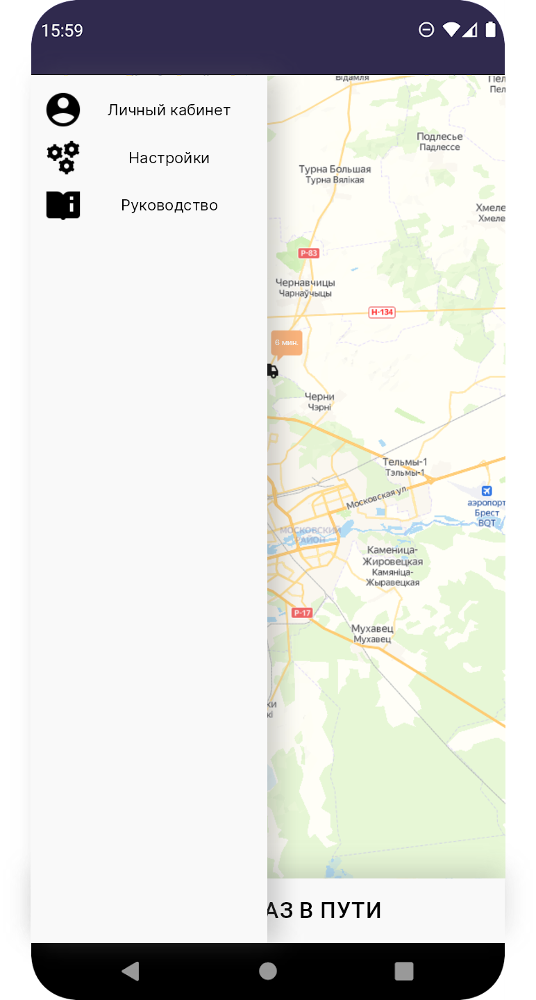

# Требования к проекту

---

[//]: # (TODO: ReWrite to SRS)

## Содержание

[1 Введение](#1-введение)  
[1.1 Глоссарий](#11-Глоссарий)  
[1.2 Назначение](#12-назначение)  
[1.3 Бизнес-требования](#13-бизнес-требования)  
[1.3.1 Исходные данные](#131-исходные-данные)  
[1.3.2 Возможности бизнеса](#132-возможности-бизнеса)  
[1.3.3 Границы проекта](#133-границы-проекта)  
[1.4 Аналоги](#14-аналоги)  
[2 Требования пользователя](#2-требования-пользователя)  
[2.1 Программные интерфейсы](#21-программные-интерфейсы)  
[2.2 Интерфейс пользователя](#22-интерфейс-пользователя)  
[2.3 Характеристики пользователей](#23-характеристики-пользователей)  
[2.3.1 Классы пользователей](#231-классы-пользователей)  
[2.3.2 Аудитория приложения](#232-аудитория-приложения)  
[2.3.2.1 Целевая аудитория](#2321-целевая-аудитория)  
[2.3.2.1 Побочная аудитория](#2322-побочная-аудитория)  
[2.4 Предположения и зависимости](#24-предположения-и-зависимости)  
[3 Системные требования](#3-системные-требования)  
[3.1 Функциональные требования](#31-функциональные-требования)  
[3.1.1 Основные функции](#311-основные-функции)  
[3.1.1.1 Вход пользователя в приложение](#3111-вход-пользователя-в-приложение)  
[3.1.1.2 Наличие уведомлений](#3112-наличие-уведомлений)  
[3.1.1.3 Изменение уведомлений](#3113-изменение-уведомлений)  
[3.1.1.4 Выход зарегистрированного пользователя из учётной записи](#3114-выход-зарегистрированного-пользователя-из-учётной-записи)  
[3.1.1.5 Регистрация нового пользователя после входа в приложение](#3115-регистрация-нового-пользователя-после-входа-в-приложение)  
[3.1.2 Ограничения и исключения](#312-ограничения-и-исключения)  
[3.2 Нефункциональные требования](#32-нефункциональные-требования)  
[3.2.1 Атрибуты качества](#321-атрибуты-качества)  
[3.2.1.1 Требования к удобству использования](#3211-требования-к-удобству-использования)  
[3.2.1.2 Требования к безопасности](#3212-требования-к-безопасности)  
[3.2.2 Внешние интерфейсы](#322-внешние-интерфейсы)  
[3.2.3 Ограничения](#323-ограничения)

# 1 Введение

## 1.1 Глоссарий

Курс валют - цена денежной единицы одной страны, выраженная в денежной 
единице другой.  
Вклад - сумма денег, переданная лицом с целью получения доходов в виде 
процентов, образующихся в ходе финансовых операций с вкладом.  
Архивированные курсы - в большинстве случаев график курсов купли/продажи 
определённого курса валют.  
Уведомления на курс - уведомление, которое будет приходить при достижении 
поставленной суммы купли или продажи определённой валюты в любом или 
конкретном банке.

## 1.2 Назначение

В этом документе описаны функциональные и нефункциональные требования к 
программной системе нвигации для грузоперевозок. Этот документ 
предназначен для команды, которая будет реализовывать и проверять корректность 
работы приложения.

## 1.3 Бизнес-требования

### 1.3.1 Исходные данные

Множество людей любой возрастной категории зачастую нуждаются в перевозку грузов
или документов. Существует множество компаний занимающихся организацией грузоперевозок,
однако они страдают оперативностью, в то время как перевозка грузов может иметь срочный 
характер. Также могут случаться обманы со стороны грузоперевозчика, такие как пропажа груза
или невыполнение обязательств без какого либо возврата вознаграждения за услугу. Из этого
следует, что большинству нужно просто зайти в интеренет выбрат конечную точку и ожидать 
приезда свободной машины. Наши разработчики будут добиваться того, чтобы человек с
любым навыком использования компьютера или телефона смог интуитивно разобраться
в нашем приложении.

### 1.3.2 Возможности бизнеса

Большинству людей требуется иметь возможность быстро заказать автомобиль и 
перевезти необходимые вещи. Причем люди могут быть абсолютно разных уровней 
технической грамотности. Интерфейс, спроектированный с учётом этих особенностей, 
и своевременная поддержка приложения позволят увеличить приток пользователей данного
приложения многократно. Также приложение подразумевает, что пользователь с автомобилем 
имеет возможность заработать деньги став партнером сервиса. Пользователю, который хочет
стать партнером нужно всего лишь зарегестрироваться в системе как партнер и он может начать 
сразу же выпольнять заказы.

### 1.3.3 Границы проекта

Приложение "Груз" позволит пользователям находить свободные машины для грузоперевозок, 
так и предоставляет возможность на этих грузоперевозках заработать. Для всех типов пользователей
регистрация обязательна, так как требует заключение договора по оказанию услуг. Также регистрация
позволит сохранить данные пользователя такие как номер карты. 

## 1.4 Аналоги

Обзор аналогов приведён в
документе [overview_of_analogues](./Requirements/overview_of_analogues.md).

# 2 Требования пользователя

## 2.1 Программные интерфейсы

Информация о геопозиции будет браться с доступных интерфейсов таких как OSM API или YandexGeo API

## 2.2 Интерфейс пользователя

Начальный экран приложения.
    
Меню приложения. 
   
Геопозиция перевозчика и текущий статус заказа. 
  
Поиск заказа.
  

## 2.3 Характеристики пользователей

### 2.3.1 Классы пользователей

| Класс пользователей             | Описание                                                                                                                        |
|:--------------------------------|:--------------------------------------------------------------------------------------------------------------------------------|
| Зарегистрированные пользователи | Пользователи которым требуется услуга грузоперевозок                                                                            |
| Зарегистрированные партнеры     | Пользователи, которые могут выполнять заказы на своих автомобилях                                                               |

### 2.3.2 Аудитория приложения

#### 2.3.2.1 Целевая аудитория

Люди совершеннолетней возрастной категории, обладающие минимальными навыками работы с
Android утройствами, нуждающиеся в услугах грузоперевозки или способе дополнительного заработка.

#### 2.3.2.2 Побочная аудитория

Компании со своим парком автомобилей, для которых приложение отличный вариант для оптимизации работы. 

## 2.4 Предположения и зависимости

1. Приложение не работает при отсутствии подключения к Интернету;

# 3 Системные требования

<a name="system_requirements"/>

## 3.1 Функциональные требования

<a name="functional_requirements"/>

### 3.1.1 Основные функции

<a name="main_functions"/>

#### 3.1.1.1 Ввод данных

Пользователь регистрируется .

<a name="input_data"/>

#### 3.1.1.2 Работа с сервером

Пользователь имеет возможность начать поиск свободной машины, и принять ее для выполнения своих целей.

<a name="work_with_server"/>

#### 3.1.1.3 Получение информации

Пользователь имеет возможность получать информацию о геопозиции грузоперевозчика в любой момент времени пока тот выполняет заказ.

<a name="information"/>

### 3.1.2 Ограничения и исключения

1. Приложжение не работает без авторизации.
2. Проверка на отсутствие сети.
3. Данное приложение не разработано для людей с ограниченными возможностями, т.к. является узкопрофильным.

<a name="non-functional_requirements"/>

## 3.2 Нефункциональные требования

<a name="quality_attributes"/>

### 3.2.1 Атрибуты качества

1. Удобные и легкодоступные операции.
2. Все функциональные элементы пользовательского интерфейса имеют названия, описывающие действие, которое произойдет при выборе элемента.
3. Приложение надёжно. Защищает данные пользователя в зашифрованном виде на удаленных серверах.

<a name="requirements_for_ease_of_use"/>
